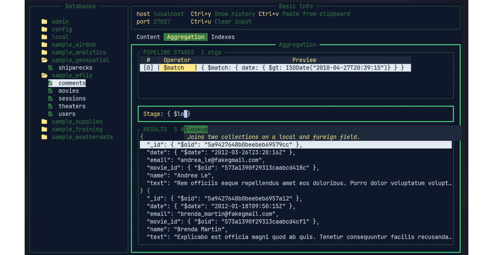

<div align="center">
  
</div>

---

## Overview

**Vi Mongo** is an intuitive Terminal User Interface (TUI) application, written
in Go, designed to streamline and simplify the management of MongoDB databases.
Emphasizing ease of use without sacrificing functionality, Vi Mongo offers a
user-friendly command-line experience for database administrators and developers
alike.

Visit [vi-mongo.com](https://vi-mongo.com) for more information.



## Installation

To quickly install use:

```sh
curl -fsSL https://vi-mongo.com/install.sh | sh
```

To install Vi Mongo via brew, yay or from source follow the instructions on the [installation page](https://vi-mongo.com/docs/installation).

If you are using [Neovim](https://neovim.io/) you can install the plugin from [nvim-plugin](https://github.com/kopecmaciej/vi-mongo.nvim)

## Features

- **Intuitive Navigation**: Vi Mongo's simple, intuitive interface makes it easy
  to navigate and manage your MongoDB databases.
- **Fast switching between databases**: Vi Mongo allows you to fast switch
  between databases.
- **Managing Documents**: Vi Mongo allows you to view, create, update, duplicate
  and delete documents in your databases with ease. Supports both inline editing
  and full document editing in your preferred external editor.
- **Managing Collections**: Vi Mongo provides a simple way to manage your
  collections, including the ability to create, delete, and rename collections.
- **Aggregation Pipelines**: Built-in aggregation pipeline builder with
  stage management (add, edit, delete, reorder), pipeline execution, and results
  displayed in table or JSON view.
- **Autocomplete**: Vi Mongo offers an autocomplete feature that suggests
  collection names, database names, MongoDB commands, and aggregation pipeline
  operators as you type.
- **Query History**: Vi Mongo keeps track of your query history, allowing you to
  easily access and reuse previous queries.
- **Mongosh Syntax Support**: Vi Mongo supports standard MongoDB Shell
  (mongosh) syntax, including regex literals (`/pattern/flags`), `ISODate()`,
  `NumberInt()`, `NumberLong()`, and `NumberDecimal()` helper functions.
- **YAML Keybindings**: Fully customizable keybindings via `keybindings.yaml`,
  with automatic migration from older JSON format.
- **Multiple Styles**: Vi Mongo supports multiple color schemes, they can be
  selected in config file or add/modify easily.
- **Environment Variable URIs**: Connection URLs can reference environment
  variables (e.g. `$MONGODB_URI`), making it safe to commit config files to
  version control.

## List of features to be implemented

[vi-mongo.com/docs/roadmap](https://vi-mongo.com/docs/roadmap)

## Contributing

All contributions are welcome!

1. Create an issue
2. Fork the repository
3. Go with the flow

If possible please write tests for your changes.

## Issues

For now all issues are resolved, but if you find any new issues, please report
them in the [GitHub Issues](https://github.com/kopecmaciej/vi-mongo/issues)
page.
